<div align="center">

# 🛒 M-Cart

### Enterprise Multi-Vendor eCommerce + Hyperlocal Delivery Backend


**One backend → Web (Next.js) · Android · iOS · Flutter · React Native · Admin Panel · Vendor Panel · Delivery App**

</div>

---

## 📑 Table of Contents

| # | Section | # | Section |
|---|---|---|---|
| 1 | [Quick Start](#-1-quick-start) | 9 | [Razorpay Payment Flow](#-9-razorpay-payment-flow) |
| 2 | [System Architecture](#-2-system-architecture) | 10 | [How Profit Works 💰](#-10-how-profit-works) |
| 3 | [How Apps Connect (Web + Mobile)](#-3-how-the-apps-connect-web--mobile) | 11 | [The Request Lifecycle (DB save)](#-11-the-request-lifecycle--how-data-is-saved) |
| 4 | [Database / ER Diagram](#-4-database--er-diagram) | 12 | [How Kafka Works](#-12-how-kafka-works) |
| 5 | [Project Structure](#-5-project-structure) | 13 | [Git & CI/CD Pipeline 🚀](#-13-git--cicd-pipeline) |
| 6 | [Complete API Reference + Payloads](#-6-complete-api-reference--payloads) | 14 | [One Complete Sale (end-to-end)](#-14-one-complete-sale-end-to-end) |
| 7 | [Tech Stack & Security](#-7-tech-stack--security) | 15 | [🔑 JWT Auth Deep-Dive](#-15-jwt-auth-deep-dive-why--when--where) |
| 8 | [Role Workflows](#-8-role-workflows) | 16 | [🗃️ Collections & How Data Is Stored](#️-16-collections--how-data-is-stored) |
| | | 17 | [🧪 cURL Quickstart (real payloads)](#-17-curl-quickstart-real-payloads) |
| | | 18 | [📂 All APIs by Panel](#-18-all-apis-by-panel) |

---

## 🚀 1. Quick Start

```bash
cp .env.example .env                       # fill secrets (use TEST keys in dev)
npm install
docker compose up -d mongo redis           # start MongoDB + Redis
npm run start:dev                          # 🚀 http://localhost:3000/api
```

| What | URL |
|---|---|
| 📖 **Swagger UI** (try every API live) | http://localhost:4000/api/docs |
| ❤️‍🩹 **Health probe** | http://localhost:4000/api/v1/health |
| 🧪 **Run tests** | `npm test` · coverage: `npm run test:cov` |

> **Base URL** `http://localhost:3000/api` · **Versioning** URI-based → every route is `/api/v1/...` · **Auth** `Authorization: Bearer <accessToken>`

---

## 🏗️ 2. System Architecture

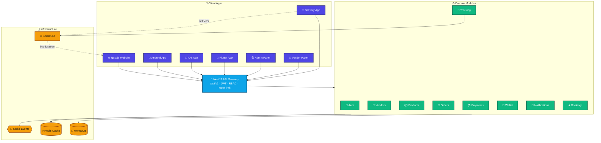

---

## 📲 3. How the Apps Connect (Web + Mobile)

Every client — web **and** mobile — talks to the **same REST API** at `/api/v1/...`. Auth is identical everywhere: a **JWT access token** in `Authorization: Bearer <token>`, refreshed via a rotating **refresh token**.

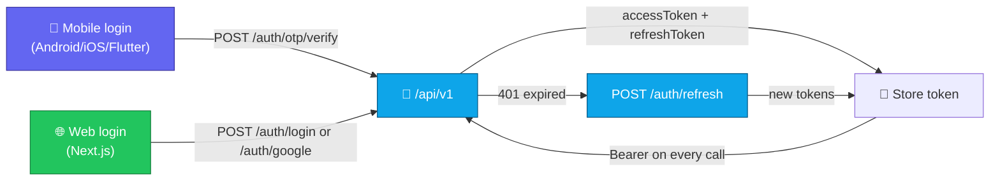

| Panel | Suggested stack | Key APIs |
|---|---|---|
| 🧑 **Customer** | Next.js / React Native | auth · products · cart · wishlist · orders · payments · tracking · reviews |
| 🏪 **Vendor** | React SPA | vendors · products · inventory · orders (vendor/list) · earnings |
| 🛵 **Delivery** | Flutter / React Native | delivery · tracking · earnings |
| 🛡️ **Admin** | React SPA | approve/reject vendor·delivery·product · coupons · refunds · audit · flags |

> **Mobile** = OTP + Google · **Web** = email/password + Google · **all** share the same product/cart/order/payment APIs. Build the UI once per platform — the backend is shared. Gate the UI by the `role` claim inside the JWT.

---

## 🗄️ 4. Database / ER Diagram

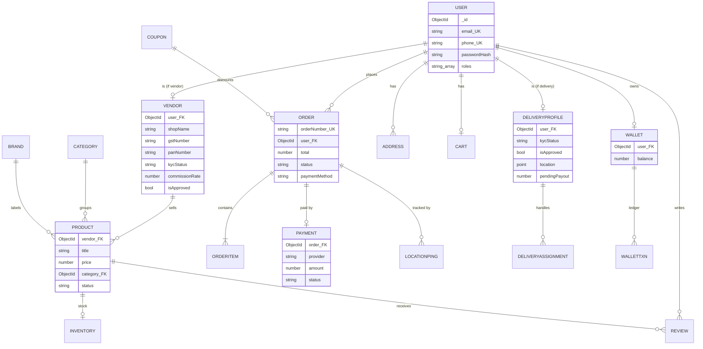

**Indexing:** unique sparse indexes on `email`/`phone`/`googleId`; query indexes on `product.vendor`, `product.category`, `product.status`, `order.user`, `order.status`, `payment.order`, `deliveryprofile.location` (**2dsphere** geo). Pagination (`page`/`limit`) on all list endpoints. *(Full collection field map → [§16](#️-16-collections--how-data-is-stored).)*

---

## 📂 5. Project Structure

```
M-Cart/
├── src/
│   ├── main.ts                 # bootstrap · Swagger · versioning · global filter
│   ├── app.module.ts           # wires all modules + Mongo + Throttler
│   ├── common/                 # enums(roles) · @Roles/@CurrentUser · guards(JWT,RBAC) · filters
│   ├── auth/        🔐  register · login · OTP · google · refresh · logout · me
│   ├── users/       👤  profile & identity
│   ├── vendors/     🏪  onboarding · KYC · GST/PAN verify · approve
│   ├── categories/  🗂️  · brands/ 🏷️  · products/ 📦 (CRUD + APPROVAL) · inventory/ 📊
│   ├── cart/ 🛒 · wishlist/ ❤️ · coupons/ 🎟️ · addresses/ 🏠 · reviews/ ⭐
│   ├── orders/      🧾  order lifecycle state-machine
│   ├── payments/    💳  Razorpay · UPI · COD · webhook · refund
│   ├── wallet/      👛  balance · ledger · commission split
│   ├── delivery/ 🛵 · tracking/ 📍 (Socket.IO live GPS · 2dsphere auto-assign · POD OTP)
│   ├── notifications/🔔 · bookings/ ✈️🚌 · feature-flags/🚩 · audit/🧾 · health/❤️‍🩹
│   ├── kafka/       📨  event producer + topic registry
│   └── redis/       ⚡  cache service
├── k8s/             ☸️  deployment · service · HPA · config/secret
├── Dockerfile · docker-compose.yml
├── .github/workflows/   ci.yml · gemini-code-review.yml
└── test/ + *.spec.ts    Jest unit tests
```

---

## 📋 6. Complete API Reference + Payloads

> Path = `/api/v1` + route. **Access:** 🔓 public · 🔒 any JWT · 👑 admin · 🏪 vendor · 🛵 delivery · 🛒 customer.
> The **Body** column lists request fields (`?` = optional). See [§17](#-17-curl-quickstart-real-payloads) for runnable cURL.

<details open><summary><b>🔐 Auth — <code>/auth</code></b></summary>

| Method | Endpoint | Access | Description | Body |
|---|---|---|---|---|
| POST | `/auth/register` | 🔓 | Email + password signup | `name, email, password` |
| POST | `/auth/login` | 🔓 | Email + password login | `email, password` |
| POST | `/auth/otp/request` | 🔓 | Send phone OTP | `phone` |
| POST | `/auth/otp/resend` | 🔓 | Resend OTP | `phone` |
| POST | `/auth/otp/verify` | 🔓 | Verify OTP → login | `phone, code` |
| POST | `/auth/google` | 🔓 | Google ID-token login | `idToken, email?` |
| POST | `/auth/refresh` | 🔓 | Rotate tokens | `refreshToken` |
| POST | `/auth/logout` | 🔒 | Revoke session | — |
| GET | `/auth/me` | 🔒 | Current identity | — |
</details>

<details><summary><b>👤 Users / User Management — <code>/users</code></b></summary>

| Method | Endpoint | Access | Description | Body |
|---|---|---|---|---|
| GET | `/users/me` | 🔒 | Get my profile | — |
| PATCH | `/users/me` | 🔒 | Update my profile | `name?, email?, phone?` |
| GET | `/users` | 👑 | List users (paginated, filterable) | `?page&limit&role&isActive&search` |
| GET | `/users/:id` | 👑 | Get a user by id | — |
| PATCH | `/users/:id/status` | 👑 | Activate / deactivate user | `isActive` |
| PATCH | `/users/:id/roles` | 👑 | Update a user's roles | `roles[]` |
</details>

<details><summary><b>🏪 Vendors — <code>/vendors</code></b></summary>

| Method | Endpoint | Access | Description | Body |
|---|---|---|---|---|
| POST | `/vendors/register` | 🏪 | Register shop (KYC pending) | `shopName, gstNumber, panNumber, bankAccount, ifsc, upiId?, address` |
| POST | `/vendors/upload-documents` | 🏪 | Upload KYC docs | `documents[] {type,url}` |
| POST | `/vendors/submit-kyc` | 🏪 | Submit for review | — |
| GET / PUT | `/vendors/profile` | 🏪 | View / update profile | partial |
| GET | `/vendors/dashboard` | 🏪 | Sales dashboard counts | — |
| GET | `/vendors/earnings` | 🏪 | Earnings summary | — |
| PATCH | `/vendors/:id/approve` | 👑 | Approve vendor | — |
| PATCH | `/vendors/:id/reject` | 👑 | Reject vendor | `reason` |
| POST | `/vendors/:id/verify-kyc` | 👑 | GST/PAN verification | — |
</details>

<details><summary><b>📦 Catalog — Products / Categories / Brands / Inventory</b></summary>

| Method | Endpoint | Access | Description | Body |
|---|---|---|---|---|
| POST | `/products` | 🏪 | Add product → **pending** | `title, slug, description, price, mrp, currency?, category, brand?, images?, attributes?` |
| POST | `/products/bulk-upload` | 🏪 | Bulk add | `products[]` |
| GET | `/products` | 🔓 | Browse approved (filters) | `?category&brand&search&minPrice&maxPrice&page&limit` |
| GET | `/products/:id` | 🔓 | Product detail | — |
| PUT / DELETE | `/products/:id` | 🏪👑 | Update / delete | partial |
| PATCH | `/products/:id/approve` | 👑 | Approve | — |
| PATCH | `/products/:id/reject` | 👑 | Reject | `reason` |
| GET / POST / PUT / DELETE | `/categories` · `/categories/:id` | 🔓/👑 | Category tree | `name, slug, parent?, image?, isActive?` |
| GET / POST / PUT / DELETE | `/brands` · `/brands/:id` | 🔓/👑 | Brands | `name, slug, logo?, isActive?` |
| GET | `/inventory/:productId` | 🏪👑 | Stock level | — |
| PATCH | `/inventory/:productId/adjust` | 🏪👑 | Adjust stock by delta | `delta` (signed) |
</details>

<details><summary><b>🛒 Shopping — Cart / Wishlist / Coupons / Addresses / Reviews</b></summary>

| Method | Endpoint | Access | Description | Body |
|---|---|---|---|---|
| GET | `/cart` | 🛒 | Get cart | — |
| POST | `/cart` | 🛒 | Add item | `product, vendor, quantity, price` |
| PUT / DELETE | `/cart/:itemId` | 🛒 | Update / remove item | `quantity` |
| DELETE | `/cart` | 🛒 | Clear cart | — |
| GET / POST / DELETE | `/wishlist` · `/wishlist/:productId` | 🛒 | Manage wishlist | `productId` |
| GET / POST / PUT / DELETE | `/coupons` · `/coupons/:id` | 👑 | Manage coupons | `code, type(PERCENT\|FIXED), value, minOrder?, maxDiscount?, usageLimit?, expiresAt?, isActive?` |
| POST | `/coupons/validate` | 👑 | Validate vs amount | `code, orderAmount` |
| GET / POST / PUT / DELETE | `/addresses` · `/addresses/:id` | 🛒 | Manage addresses | `label?, line1, line2?, city, state, country?, pincode, phone, isDefault?` |
| PATCH | `/addresses/:id/default` | 🛒 | Set default | — |
| POST | `/reviews` | 🛒 | Create review | `product, rating(1-5), comment?` |
| GET | `/reviews` | 🔓 | Product reviews | `?productId&page&limit` |
| DELETE | `/reviews/:id` | 🛒👑 | Delete (owner/admin) | — |
</details>

<details><summary><b>🧾 Orders — <code>/orders</code></b></summary>

| Method | Endpoint | Access | Description | Body |
|---|---|---|---|---|
| POST | `/orders` | 🛒 | Place order | `items[], discount?, currency?, paymentMethod, shippingAddress` |
| GET | `/orders` | 🛒 | My orders | `?page&limit` |
| GET | `/orders/vendor/list` | 🏪 | Orders with my items | — |
| GET | `/orders/admin/list` | 👑 | All orders | `?page&limit` |
| GET | `/orders/:id` | 🔓 | Order detail | — |
| PATCH | `/orders/:id/status` | 👑🏪🛵 | Advance status (forward only) | `status, note?` |
| POST | `/orders/:id/cancel` | 🛒 | Cancel | — |
| POST | `/orders/:id/return` | 🛒 | Request return | — |
| PATCH | `/orders/:id/assign-delivery` | 👑 | Assign delivery partner | `deliveryUserId` |
</details>

<details><summary><b>💳 Payments & 👛 Wallet</b></summary>

| Method | Endpoint | Access | Description | Body |
|---|---|---|---|---|
| POST | `/payments/create-order` | 🛒 | Create gateway order | `orderId, amount` |
| POST | `/payments/verify` | 🛒 | Verify signature | `providerOrderId, providerPaymentId, signature` |
| POST | `/payments/webhook` | 🔓 | Provider webhook (HMAC) | `event, payload` |
| POST | `/payments/refund` | 👑 | Refund | `paymentId, amount?` |
| POST | `/payments/cod-confirm` | 🛒 | Confirm COD | `orderId` |
| GET | `/wallet/balance` | 🛒🏪 | Balance | — |
| POST | `/wallet/add-money` | 🛒🏪 | Top up | `amount(≥1), reason` |
| POST | `/wallet/withdraw` | 🛒🏪 | Withdraw | `amount(≥1), reason?` |
| GET | `/wallet/history` | 🛒🏪 | Ledger | `?page&limit` |
</details>

<details><summary><b>🛵 Delivery — <code>/delivery</code> (KYC · live ops · POD · admin)</b></summary>

| Method | Endpoint | Access | Description | Body |
|---|---|---|---|---|
| POST | `/delivery/register` | 🛵 | Register partner | `fullName, aadhaarNumber, panNumber, drivingLicense, bankAccount, ifsc, upiId?, vehicleType, vehicleNumber, zone?` |
| POST | `/delivery/upload-documents` | 🛵 | Upload KYC docs | `documents[] {type,url}` |
| POST | `/delivery/submit-kyc` | 🛵 | Submit KYC | — |
| GET / PUT | `/delivery/profile` | 🛵 | View / update profile | partial |
| GET | `/delivery/earnings` | 🛵 | Earnings dashboard | — |
| POST | `/delivery/online` · `/offline` | 🛵 | Toggle availability | — |
| GET | `/delivery/orders` | 🛵 | Assigned (active) orders | — |
| POST | `/delivery/accept` | 🛵 | Accept order | `orderId` |
| POST | `/delivery/pickup` | 🛵 | Pickup → **issues POD OTP** | `orderId` |
| POST | `/delivery/location` | 🛵 | Update live location | `lat, lng` |
| POST | `/delivery/proof-of-delivery` | 🛵 | Deliver w/ **OTP + photo** | `orderId, otp(4-6), photoUrl?` |
| POST | `/delivery/:id/assign` | 👑 | Manual assign | `orderId` |
| POST | `/delivery/auto-assign` | 👑 | **Nearest-partner** assign (2dsphere) | `orderId, lat, lng, zone?` |
| POST | `/delivery/:id/payout` | 👑 | Settle weekly payout | — |
| PATCH | `/delivery/:id/approve` · `/reject` | 👑 | Approve / reject partner | `reason` (reject) |
| POST | `/delivery/:id/verify-kyc` | 👑 | Verify KYC | — |
</details>

<details><summary><b>📍 Tracking · ✈️ Bookings · 🔔 Notifications · 🚩 Flags · 🧾 Audit · ❤️‍🩹 Health</b></summary>

| Method | Endpoint | Access | Description | Body |
|---|---|---|---|---|
| POST | `/tracking/location` | 🛵 | Push GPS ping | `orderId, lat, lng` |
| GET | `/tracking/order/:id` · `/live/:id` | 🔓 | History / latest location | — |
| GET / POST / GET | `/flights/search` · `/book` · `/tickets` | 🔓/🛒 | Flights | `flightId, passengers[] {name,age,seat?}` |
| GET / POST / GET | `/bus/search` · `/book` · `/tickets` | 🔓/🛒 | Bus | `busId, seats[]` |
| GET | `/notifications` | 🔒 | My notifications | `?page&limit` |
| PATCH | `/notifications/:id/read` · `/read-all` | 🔒 | Mark read | — |
| POST | `/notifications/test` | 👑 | Send test | `userId, channel(email\|sms\|push\|whatsapp), title, body` |
| GET | `/feature-flags` · `/feature-flags/:key` | 🔓 | List / check flag | — |
| PUT | `/feature-flags` | 👑 | Create/update flag | `key, enabled, description?, rolloutPercentage?(0-100)` |
| GET | `/audit-logs` | 👑 | Audit trail | `?page&limit` |
| GET | `/health` | 🔓 | Liveness / DB probe | — |
</details>

---

## 🔐 7. Tech Stack & Security

**Stack:** NestJS 10 · TypeScript · MongoDB (Mongoose) · Redis · Kafka · Socket.IO · JWT + Passport · Swagger · class-validator · Jest · Docker · Kubernetes · GitHub Actions + Gemini AI review.

**Security baked in:**
- 🔑 Passwords **bcrypt**-hashed, never returned (`select:false`)
- 🔄 Short-lived **access JWT** + long-lived **rotating refresh JWT**; refresh hash stored server-side, **reuse detected** ([§15](#-15-jwt-auth-deep-dive-why--when--where))
- 🛡️ **RBAC** via `@Roles()` + `RolesGuard` — 5 roles: `customer · vendor · delivery · admin · super_admin`
- ✅ Global `ValidationPipe` (whitelist + forbidNonWhitelisted) + **rate limiting**
- 🧾 **Audit logs** + global exception filter with structured logging
- 🔒 Secrets only via env / secret-manager — **never in code or git** (Razorpay verify uses constant-time HMAC compare)

---

## 🧭 8. Role Workflows

### 👤 Customer journey


### 🏪 Vendor onboarding + product approval → publish
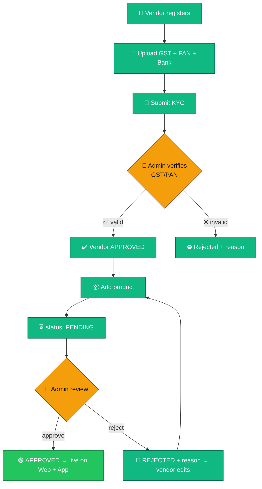

> **How "publishing" works:** there's no publish button — it's the `status` field. The public listing queries `find({ status:'approved', isActive:true })`, so the instant an admin sets `status = approved`, the product appears for every customer. ✅

### 🛡️ Admin governs every panel
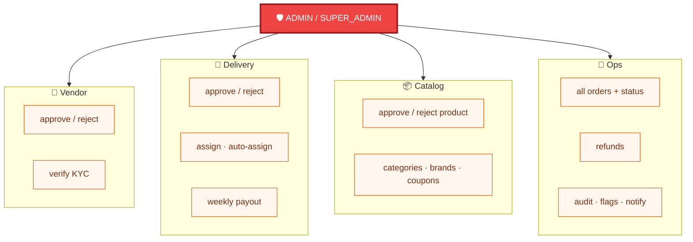

### 🧾 Order status state-machine (forward-only)
```mermaid
stateDiagram-v2
    [*] --> placed
    placed --> confirmed --> packed --> shipped --> out_for_delivery --> delivered
    placed --> cancelled
    confirmed --> cancelled
    delivered --> returned
    delivered --> [*]
    cancelled --> [*]
    returned --> [*]
```

### 🛵 Delivery boy + live tracking + proof-of-delivery
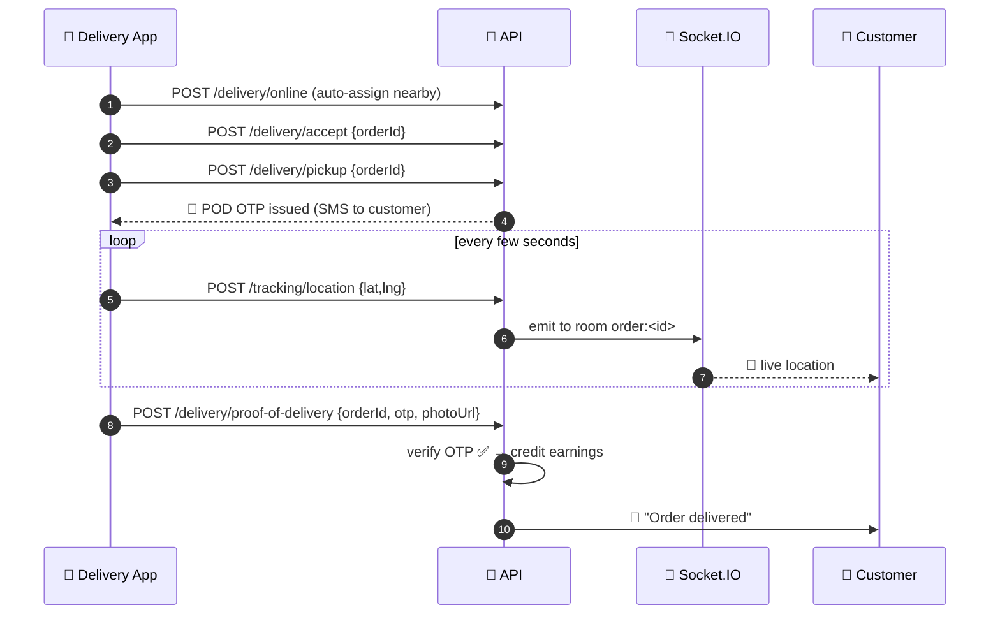

---

## 💳 9. Razorpay Payment Flow

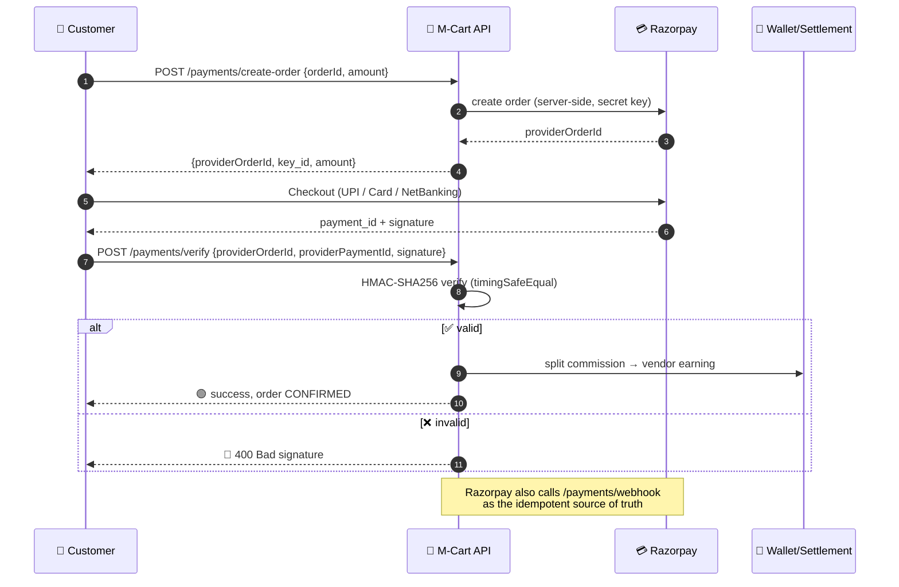

> 🔒 `RAZORPAY_KEY_SECRET` lives only in env / secret-manager. Use `rzp_test_*` keys in dev; live keys only in production. 💵 **COD:** `POST /payments/cod-confirm {orderId}`. 🔁 **Refund (admin):** `POST /payments/refund {paymentId, amount?}`.

---

## 💰 10. How Profit Works

M-Cart earns a **platform commission** on every sale — default **10%**, configurable per vendor (`vendor.commissionRate`).

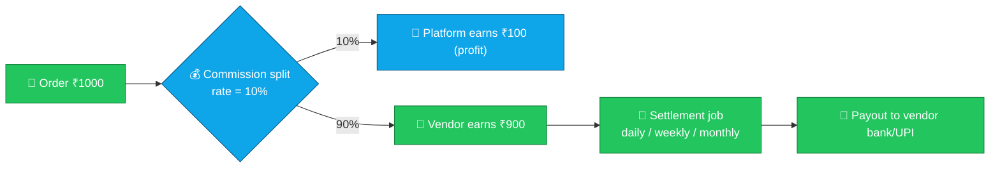

| Item | Amount |
|---|---|
| Order total | **₹1000** |
| Platform commission (10%) | **₹100** ← *M-Cart's profit* |
| Vendor earning (90%) | **₹900** |

`SettlementService.computeCommission(total, rate)` credits the vendor's wallet + ledger entry; a scheduled job pays out balances on a cycle. Refunds reverse the split. Delivery partners earn a flat per-delivery payout, settled weekly via `POST /delivery/:id/payout`. **Other revenue:** delivery fees, promotions, booking convenience fees, wallet float.

---

## 🔄 11. The Request Lifecycle — How Data Is Saved

Every endpoint follows the **same pipeline**:

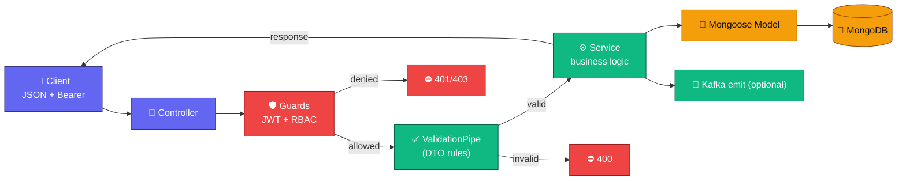

1. **Controller** maps the HTTP request to a method.
2. **Guards** verify the JWT (`req.user = {userId, roles}`) then check `@Roles()` → 403 if not allowed.
3. **ValidationPipe** checks the body against the **DTO** → 400 if invalid, strips unknown fields.
4. **Service** runs pure business logic (totals, stock, hashing) — easy to unit-test.
5. **Mongoose Model** applies the **schema** (types, defaults, indexes) and writes to **MongoDB**.
6. Clean response returns to the client. *Schema = shape · Service = logic · Controller = HTTP door.*

---

## 📨 12. How Kafka Works

Kafka decouples modules: a module **emits an event** instead of calling ten others directly. Consumers **subscribe** and react independently — this is what scales.

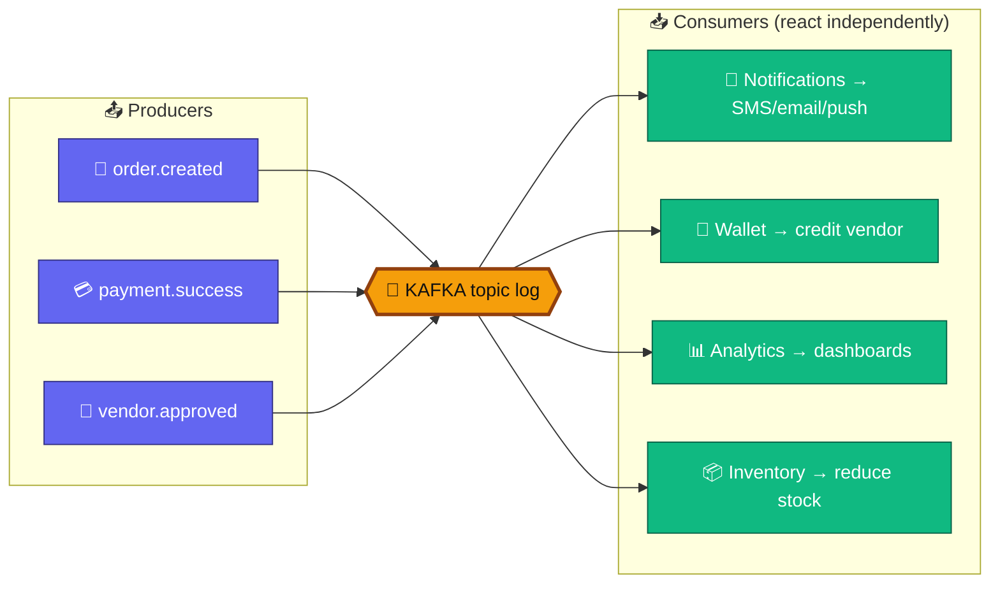

> If Notifications is slow/down, Orders still works — events wait in Kafka and process when consumers are ready. *Topics live in `src/kafka/`; the producer ships as a logging stub so it runs without a broker — swap in `kafkajs` for production.*

---

## 🚀 13. Git & CI/CD Pipeline

```mermaid
flowchart LR
    DEV["👨‍💻 git push"] --> GH["🐙 GitHub"] --> ACT["⚙️ GitHub Actions"]
    ACT --> LINT["🧹 Lint"] --> TEST["🧪 Jest + coverage"] --> GEM["🤖 Gemini AI Review<br/>(PR comment)"] --> BUILD["🏗️ nest build"] --> DOCK["🐳 docker build"] --> DEPLOY["☸️ Deploy (k8s / EC2)"]
    classDef git fill:#8B5CF6,stroke:#5B21B6,color:#fff;
    classDef ci fill:#0EA5E9,stroke:#075985,color:#fff;
    classDef ai fill:#F59E0B,stroke:#92400E,color:#111;
    classDef dep fill:#22C55E,stroke:#15803D,color:#fff;
    class DEV,GH git;
    class ACT,LINT,TEST,BUILD,DOCK ci;
    class GEM ai;
    class DEPLOY dep;
```

- **`ci.yml`** → lint → test → build → docker build on every push/PR.
- **`gemini-code-review.yml`** → posts an **AI review** of each PR diff (needs `GEMINI_API_KEY` secret).
- **Branch flow:** `feature/*` → PR → `develop` → `main` → deploy.

---

## 🗺️ 14. One Complete Sale (end-to-end)

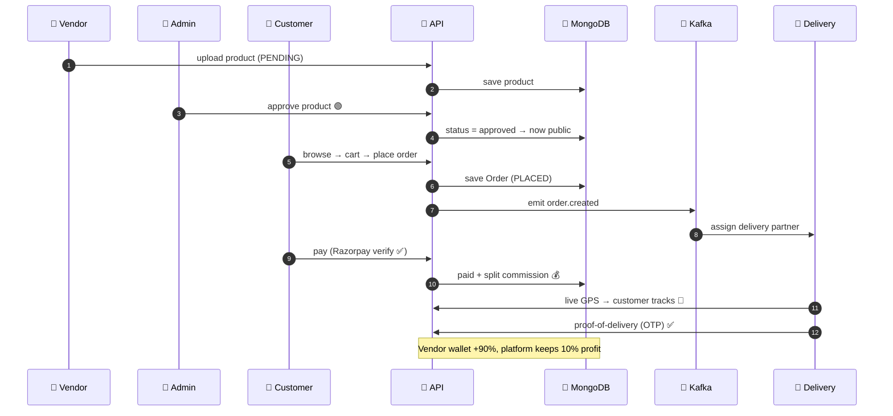

---

## 🔑 15. JWT Auth Deep-Dive (Why · When · Where)

**Why JWT?** It's a **stateless** signed token — the API can trust it without a DB lookup on every request, so it scales horizontally. We pair it with a **refresh token** so the short-lived access token can expire quickly (security) while the user stays logged in (UX).

**Two tokens, two jobs:**

| Token | Lifetime | Where stored (client) | Used for |
|---|---|---|---|
| **accessToken** | short (e.g. 15 min) | memory / app state | sent as `Authorization: Bearer` on **every** protected call |
| **refreshToken** | long (e.g. 30 days) | secure storage / httpOnly cookie | exchanged at `/auth/refresh` to mint a new access token |

**Access token payload (claims):**
```json
{ "sub": "<userId>", "roles": ["customer"], "iat": 1718870400, "exp": 1718871300 }
```

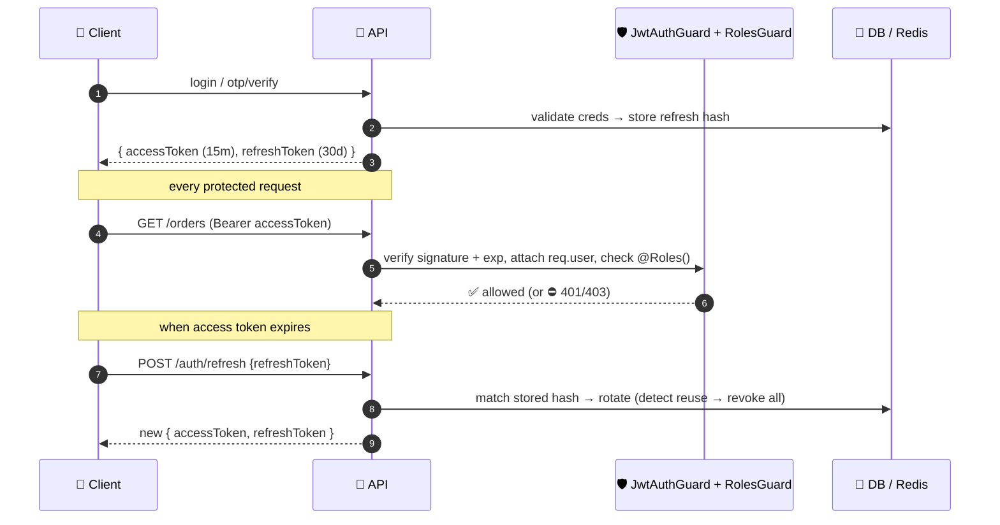

- **When** is it checked? On **every** non-public route — `JwtAuthGuard` runs first, then `RolesGuard` reads `@Roles(...)`.
- **Where** in code? `src/common/guards/jwt-auth.guard.ts` + `roles.guard.ts`, applied via `@UseGuards(JwtAuthGuard, RolesGuard)` and the `@Roles()` / `@CurrentUser()` decorators.
- **Reuse detection:** the refresh token is hashed and stored server-side; presenting an old/rotated refresh token revokes the whole session chain.

---

## 🗃️ 16. Collections & How Data Is Stored

MongoDB stores **documents** (JSON-like). Some data is **embedded** (sub-documents, fast to read together) and some is **referenced** (`ObjectId` foreign keys, normalized). Below is every collection and its storage style.

| Collection | Stores | Key fields | Storage style |
|---|---|---|---|
| **users** | accounts (all roles) | `email`(unique), `phone`(unique), `passwordHash`(select:false), `roles[]`, `googleId` | root doc |
| **vendors** | seller profiles | `user`(ref), `shopName`, `gstNumber`, `panNumber`, `kycStatus`, `isApproved`, `commissionRate` | ref → user |
| **deliveryprofiles** | delivery partners | `user`(ref), `kycStatus`, `isApproved`, **`location`(GeoJSON Point, 2dsphere)**, `assignments[]`(embedded), `payouts[]`(embedded), `pendingPayout` | ref + embedded |
| **products** | catalog items | `vendor`(ref), `category`(ref), `brand`(ref), `title`, `slug`(unique), `price`, `mrp`, `status` | refs |
| **categories** | category tree | `name`, `slug`(unique), `parent`(self-ref) | self-ref tree |
| **brands** | brands | `name`, `slug`(unique), `logo` | root doc |
| **inventory** | stock per product | `product`(ref), `quantity` | ref → product |
| **carts** | active carts | `user`(ref, unique), `items[]`(embedded `CartItem`: product, vendor, qty, price) | embedded items |
| **wishlists** | saved products | `user`(ref), `products[]`(refs) | array of refs |
| **coupons** | discounts | `code`(unique), `type`, `value`, `usageLimit`, `expiresAt` | root doc |
| **addresses** | delivery addresses | `user`(ref), `line1`, `city`, `pincode`, `isDefault` | ref → user |
| **reviews** | product reviews | `user`(ref), `product`(ref), `rating`, `comment` | refs |
| **orders** | orders | `orderNumber`(unique), `user`(ref), `items[]`(embedded `OrderItem` snapshots), `pricing`, `status`, `timeline[]`(embedded `OrderStatusEntry`) | embedded snapshots |
| **payments** | payment records | `order`(ref), `provider`, `amount`, `status`, `providerOrderId` | ref → order |
| **wallets** | balances | `user`(ref, unique), `balance` | ref → user |
| **wallettransactions** | money ledger | `wallet`(ref), `amount`, `type`, `reason` | ref → wallet |
| **locationpings** | GPS history | `order`(ref), `lat`, `lng`, `createdAt` | append-only |
| **notifications** | inbox | `user`(ref), `channel`, `title`, `body`, `isRead` | ref → user |
| **flightbookings / busbookings** | travel tickets | `user`(ref), `flight`/`bus`(ref), passengers/seats | refs |
| **featureflags** | toggles | `key`(unique), `enabled`, `rolloutPercentage` | root doc |
| **auditlogs** | who-did-what | `actor`, `action`, `target`, `createdAt` | append-only |

> **Why embed vs reference?** Order *items* are **embedded as snapshots** (title/price at purchase time) so an order never changes when a product later changes. The cart embeds items for one-read checkout. Cross-entity links (user↔order↔payment) are **referenced** to stay normalized and queryable. Every collection carries `createdAt`/`updatedAt` (`timestamps:true`).

---

## 🧪 17. cURL Quickstart (real payloads)

```bash
# 0) Health
curl http://localhost:3000/api/v1/health

# 1) Register a customer  → returns { accessToken, refreshToken, user }
curl -X POST http://localhost:3000/api/v1/auth/register \
  -H "Content-Type: application/json" \
  -d '{"name":"Asha Rao","email":"mallesh@example.com","password":"P@ssw0rd123"}'

TOKEN="<paste accessToken>"

# 2) Browse products (public)
curl "http://localhost:3000/api/v1/products?search=mouse&page=1&limit=10"

# 3) Add to cart
curl -X POST http://localhost:3000/api/v1/cart \
  -H "Authorization: Bearer $TOKEN" -H "Content-Type: application/json" \
  -d '{"product":"<productId>","vendor":"<vendorId>","quantity":2,"price":499}'

# 4) Place an order
curl -X POST http://localhost:3000/api/v1/orders \
  -H "Authorization: Bearer $TOKEN" -H "Content-Type: application/json" \
  -d '{
    "items":[{"product":"<id>","vendor":"<id>","title":"Mouse","quantity":2,"price":499}],
    "paymentMethod":"RAZORPAY",
    "shippingAddress":{"line1":"12 MG Road","city":"Bengaluru","state":"KA","pincode":"560001"}
  }'

# 5) Create + 6) verify payment
curl -X POST http://localhost:3000/api/v1/payments/create-order \
  -H "Authorization: Bearer $TOKEN" -H "Content-Type: application/json" \
  -d '{"orderId":"<orderId>","amount":998}'

curl -X POST http://localhost:3000/api/v1/payments/verify \
  -H "Authorization: Bearer $TOKEN" -H "Content-Type: application/json" \
  -d '{"providerOrderId":"order_xxx","providerPaymentId":"pay_xxx","signature":"<hmac>"}'

# --- Vendor: register shop & add product ---
curl -X POST http://localhost:3000/api/v1/vendors/register \
  -H "Authorization: Bearer $VENDOR_TOKEN" -H "Content-Type: application/json" \
  -d '{"shopName":"Sharma Electronics","gstNumber":"29ABCDE1234F1Z5","panNumber":"ABCDE1234F","bankAccount":"123456789012","ifsc":"HDFC0001234","address":{"line1":"12 MG Road","city":"Bengaluru","state":"KA","pincode":"560001"}}'

# --- Delivery partner: pickup (issues OTP) then proof-of-delivery ---
curl -X POST http://localhost:3000/api/v1/delivery/pickup \
  -H "Authorization: Bearer $DELIVERY_TOKEN" -H "Content-Type: application/json" \
  -d '{"orderId":"<orderId>"}'           # → response contains the POD otp

curl -X POST http://localhost:3000/api/v1/delivery/proof-of-delivery \
  -H "Authorization: Bearer $DELIVERY_TOKEN" -H "Content-Type: application/json" \
  -d '{"orderId":"<orderId>","otp":"482913","photoUrl":"https://cdn/pod.jpg"}'

# --- Admin: approve vendor & auto-assign nearest delivery partner ---
curl -X PATCH http://localhost:3000/api/v1/vendors/<id>/approve \
  -H "Authorization: Bearer $ADMIN_TOKEN"

curl -X POST http://localhost:3000/api/v1/delivery/auto-assign \
  -H "Authorization: Bearer $ADMIN_TOKEN" -H "Content-Type: application/json" \
  -d '{"orderId":"<orderId>","lat":12.9716,"lng":77.5946,"zone":"560001"}'
```

**Sample success response (place order):**
```json
{
  "orderNumber": "CART-2026-000123",
  "status": "placed",
  "pricing": { "subtotal": 998, "discount": 0, "deliveryCharge": 0, "total": 998 },
  "items": [{ "title": "Mouse", "quantity": 2, "price": 499 }]
}
```

---

## 📂 18. All APIs by Panel

> Base path `/api/v1`. Grouped by who uses each panel. 🟢 = public (no token).

### 🧑 Customer / Website APIs

```
# Auth (public)
POST   /api/v1/auth/register                  Register with email + password
POST   /api/v1/auth/login                     Email + password login
POST   /api/v1/auth/otp/request               Request phone OTP
POST   /api/v1/auth/otp/resend                Resend phone OTP
POST   /api/v1/auth/otp/verify                Verify OTP + login
POST   /api/v1/auth/google                    Google ID-token login
POST   /api/v1/auth/refresh                   Rotate tokens
POST   /api/v1/auth/logout                    Revoke session
GET    /api/v1/auth/me                        Authenticated identity

# My profile
GET    /api/v1/users/me                       Get my profile
PATCH  /api/v1/users/me                       Update my profile (name/email/phone)

# Browse catalog (public)
GET    /api/v1/categories                     List categories            🟢
GET    /api/v1/categories/{id}                Category by id             🟢
GET    /api/v1/brands                         List brands                🟢
GET    /api/v1/brands/{id}                    Brand by id                🟢
GET    /api/v1/products                       List/search products       🟢
GET    /api/v1/products/{id}                  Product detail             🟢
GET    /api/v1/reviews                        Product reviews            🟢
POST   /api/v1/reviews                        Write a review
DELETE /api/v1/reviews/{id}                   Delete my review

# Cart
GET    /api/v1/cart                           Get cart
POST   /api/v1/cart                           Add item
PUT    /api/v1/cart/{itemId}                  Update item quantity
DELETE /api/v1/cart/{itemId}                  Remove item
DELETE /api/v1/cart                           Clear cart

# Wishlist
GET    /api/v1/wishlist                       Get wishlist
POST   /api/v1/wishlist                       Add product
DELETE /api/v1/wishlist/{productId}           Remove product

# Addresses
GET    /api/v1/addresses                      List addresses
POST   /api/v1/addresses                      Add address
PUT    /api/v1/addresses/{id}                 Update address
DELETE /api/v1/addresses/{id}                 Delete address
PATCH  /api/v1/addresses/{id}/default         Set default address

# Coupons
POST   /api/v1/coupons/validate               Validate a coupon

# Orders
POST   /api/v1/orders                         Place an order
GET    /api/v1/orders                         My orders
GET    /api/v1/orders/{id}                    Order detail
POST   /api/v1/orders/{id}/cancel             Cancel order
POST   /api/v1/orders/{id}/return             Request a return

# Payments
POST   /api/v1/payments/create-order          Create payment order (Razorpay)
POST   /api/v1/payments/verify                Verify payment signature
POST   /api/v1/payments/cod-confirm           Confirm cash-on-delivery
POST   /api/v1/payments/webhook               Provider webhook            🟢

# Wallet
GET    /api/v1/wallet/balance                 Wallet balance
POST   /api/v1/wallet/add-money               Add money
POST   /api/v1/wallet/withdraw                Withdraw
GET    /api/v1/wallet/history                 Transactions

# Order tracking (public)
GET    /api/v1/tracking/order/{id}            Location history            🟢
GET    /api/v1/tracking/live/{id}             Latest live location        🟢

# Travel bookings
GET    /api/v1/flights/search                 Search flights              🟢
POST   /api/v1/flights/book                   Book a flight
GET    /api/v1/flights/tickets                My flight tickets
GET    /api/v1/bus/search                      Search buses               🟢
POST   /api/v1/bus/book                        Book a bus
GET    /api/v1/bus/tickets                     My bus tickets

# Notifications
GET    /api/v1/notifications                  My notifications
PATCH  /api/v1/notifications/{id}/read        Mark one read
PATCH  /api/v1/notifications/read-all         Mark all read

# Misc (public)
GET    /api/v1/feature-flags                  List feature flags          🟢
GET    /api/v1/feature-flags/{key}            Check a flag                🟢
GET    /api/v1/health                         Health probe                🟢
```

### 🏪 Vendor Panel APIs (role: `vendor`)

```
# Onboarding / profile
POST   /api/v1/vendors/register               Register vendor (KYC pending)
POST   /api/v1/vendors/upload-documents       Upload KYC docs
POST   /api/v1/vendors/submit-kyc             Submit KYC for review
GET    /api/v1/vendors/profile                Get my vendor profile
PUT    /api/v1/vendors/profile                Update my vendor profile
GET    /api/v1/vendors/dashboard              Dashboard counts
GET    /api/v1/vendors/earnings               Earnings totals

# Catalog management (own products)
POST   /api/v1/products                       Create product (pending)
POST   /api/v1/products/bulk-upload           Bulk upload products
PUT    /api/v1/products/{id}                  Update product
DELETE /api/v1/products/{id}                  Delete product

# Inventory
GET    /api/v1/inventory/{productId}          Get stock
PATCH  /api/v1/inventory/{productId}/adjust   Adjust stock (delta)

# Orders
GET    /api/v1/orders/vendor/list             Orders containing my items
PATCH  /api/v1/orders/{id}/status             Advance order status

# Wallet (payouts)
GET    /api/v1/wallet/balance                 Wallet balance
GET    /api/v1/wallet/history                 Transactions
```

### 🛵 Delivery Boy APIs (role: `delivery` — the partner's own app)

```
# Onboarding / profile
POST   /api/v1/delivery/register              Register partner (Aadhaar/PAN/DL/bank/vehicle)
POST   /api/v1/delivery/upload-documents      Upload KYC docs
POST   /api/v1/delivery/submit-kyc            Submit KYC for review
GET    /api/v1/delivery/profile               Get my profile
PUT    /api/v1/delivery/profile               Update my profile
GET    /api/v1/delivery/earnings              Earnings dashboard

# Availability
POST   /api/v1/delivery/online                Go online
POST   /api/v1/delivery/offline               Go offline

# Live operations
GET    /api/v1/delivery/orders                My assigned orders
POST   /api/v1/delivery/accept                Accept an assigned order
POST   /api/v1/delivery/pickup                Confirm pickup (issues POD OTP)
POST   /api/v1/delivery/location              Update current location
POST   /api/v1/delivery/proof-of-delivery     Deliver with OTP + photo (credits earnings)
POST   /api/v1/tracking/location              Push a live GPS ping
PATCH  /api/v1/orders/{id}/status             Advance order status
```

### 🛡️ Admin Panel APIs (role: `admin` / `super_admin`)

```
# User management
GET    /api/v1/users                          List users (paginated, filterable)
GET    /api/v1/users/{id}                     Get a user
PATCH  /api/v1/users/{id}/status              Activate / deactivate
PATCH  /api/v1/users/{id}/roles               Update roles

# Catalog governance
POST   /api/v1/categories                     Create category
PUT    /api/v1/categories/{id}                Update category
DELETE /api/v1/categories/{id}                Delete category
POST   /api/v1/brands                         Create brand
PUT    /api/v1/brands/{id}                    Update brand
DELETE /api/v1/brands/{id}                    Delete brand
PATCH  /api/v1/products/{id}/approve          Approve product
PATCH  /api/v1/products/{id}/reject           Reject product

# Coupons
POST   /api/v1/coupons                        Create coupon
GET    /api/v1/coupons                        List coupons
PUT    /api/v1/coupons/{id}                   Update coupon
DELETE /api/v1/coupons/{id}                   Delete coupon

# Orders & payments
GET    /api/v1/orders/admin/list              List all orders
PATCH  /api/v1/orders/{id}/status             Advance any order status
PATCH  /api/v1/orders/{id}/assign-delivery    Assign delivery partner
POST   /api/v1/payments/refund                Refund a payment

# Vendor governance
PATCH  /api/v1/vendors/{id}/approve           Approve vendor
PATCH  /api/v1/vendors/{id}/reject            Reject vendor
POST   /api/v1/vendors/{id}/verify-kyc        Verify GST/PAN

# Delivery governance (Delivery Admin panel)
POST   /api/v1/delivery/{id}/assign           Assign order to a partner
POST   /api/v1/delivery/auto-assign           Auto-assign to nearest partner
POST   /api/v1/delivery/{id}/payout           Settle weekly payout
PATCH  /api/v1/delivery/{id}/approve          Approve partner
PATCH  /api/v1/delivery/{id}/reject           Reject partner
POST   /api/v1/delivery/{id}/verify-kyc       Verify partner KYC

# Platform ops
POST   /api/v1/notifications/test             Send a test notification
GET    /api/v1/audit-logs                     Audit trail
PUT    /api/v1/feature-flags                  Create / update feature flag
```

---

<div align="center">

### 🛒 M-Cart
**NestJS multi-vendor marketplace** · Web + Android + iOS + Vendor + Admin + Delivery
🔐 JWT/RBAC · 💳 Razorpay · 📍 Live tracking · 💰 Commission engine · 📨 Kafka · ☸️ Kubernetes-ready

📖 **Live, always-current API docs:** run the app → **http://localhost:3000/api/docs** (Swagger, generated from code)

*Built with NestJS · TypeScript · MongoDB · Redis · Kafka · Socket.IO*

</div>
